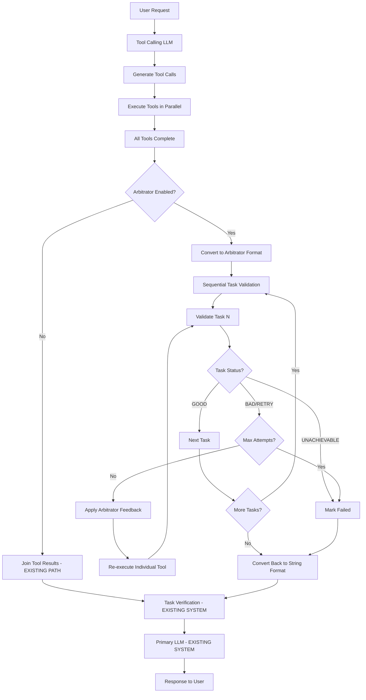

# Arbitrator System Architecture

## Overview

The Arbitrator System is an intelligent task validation and retry mechanism designed to eliminate hallucinated results from failed tool executions. It operates as an optional middleware layer between tool execution and primary LLM response generation.

## Core Problem Solved

**Before Arbitrator:**
```
User Request → Tools Execute → [Some Fail] → Task Verifier: "Complete" → Primary LLM: Fabricates Results
Result: User gets fake data (e.g., quantum: 15 occurrences vs actual: 6)
```

**With Arbitrator:**
```  
User Request → Tools Execute → [Some Fail] → Arbitrator: Validates & Retries → All Succeed → Primary LLM: Real Results
Result: User gets accurate data
```

## Architecture Design

### System Integration Flow



## Core Components

### 1. Arbitrator LLM
**Purpose:** Intelligent task result validation and retry guidance
**Configuration:** Uses separate LLM provider (default: OpenAI gpt-4o-mini)
**Input Format:** Structured JSON with task details and execution results
**Output Format:** Standardized decision JSON with feedback and retry suggestions

### 2. Circuit Breaker System
**Purpose:** Prevent infinite retry loops and resource exhaustion
**Triggers:**
- Max retries per task (3 attempts)
- Max total retries per session (10 attempts) 
- Pattern detection (infinite loops, contradictions)
- Impossibility detection (security/resource limitations)

### 3. Task Validation Loop
**Purpose:** Sequential validation with intelligent retry
**Process:**
1. Convert tool results to arbitrator task format
2. For each task: validate → retry if needed → mark final status
3. Convert validated results back to existing string format
4. Continue with existing system flow

### 4. Integration Bridges
**Purpose:** Seamless integration with existing 2-stage LLM system
**Data Conversion:** Tool results ↔ Arbitrator tasks ↔ String format
**Tool Re-execution:** Individual tool retry using existing infrastructure
**Flow Preservation:** Identical behavior when disabled

## Configuration Management

### LLM Configuration
```yaml
arbitrator:
  enabled: false                    # Default: disabled for backward compatibility
  type: openai                      # Configurable provider
  config:
    model: gpt-4o-mini             # Fast, cost-effective validation
    timeout: 60                    # Quick decisions
    context_window_size: 4096      # Sufficient for task evaluation
    temperature: 0.1               # Low temperature for consistent decisions
    max_tokens: 1024               # Compact JSON responses
    stream: false                  # Structured output doesn't need streaming
```

### Debug Logging Configuration
```yaml
debug:
  arbitrator_logging:
    enabled: true                  # Comprehensive logging until stable
    log_entry_exit: true          # Function entry/exit tracking
    log_return_values: true       # Full parameter/result capture
    log_circuit_breaker: true     # Decision tracking
    log_retry_attempts: true      # Retry logic tracking
    detailed_timing: true         # Performance metrics
```

## Compliance with Project Directives

### ✅ Multi-Tool Calling Protection
- **No modification** to tool descriptions (lines 287-385 in fastapi_server_complete.py)
- **No changes** to user_tools/*.py files
- **Preserves** existing multi-tool calling capability
- **Enhances** rather than replaces existing functionality

### ✅ Memory System Integrity  
- **Additive only** - new files, no core server modifications
- **No changes** to conversation_memory.py
- **Maintains** backward compatibility
- **Preserves** existing memory integration points

### ✅ Configuration Management
- **Uses llm_config_tool.py** for all configuration changes
- **No manual** config file edits
- **Validates** configuration compatibility
- **Tests** server startup with changes

### ✅ Architecture Preservation
- **Maintains** two-stage LLM processing (tool calling → primary LLM)
- **Preserves** race condition architecture
- **Protects** email/file generation workflow
- **Ensures** all existing functionality works identically when disabled

## Injection Points

### Primary Integration Point
**Location:** `fastapi_server_complete.py` after tool execution completion
**Current Code:**
```python
tool_results_list = await asyncio.gather(*tool_tasks, return_exceptions=True)
tools_results = "".join(tools_results_list)  # ← INJECT HERE
logger.info(f"🎯 ALL TOOL EXECUTION COMPLETED - Starting task verification")
```

**Enhanced Code:**
```python
tool_results_list = await asyncio.gather(*tool_tasks, return_exceptions=True)

# ARBITRATOR INJECTION (Optional, configurable)
if config.get('arbitrator', {}).get('enabled', False):
    arbitrator_tasks = convert_to_arbitrator_format(tool_calls, tool_results_list)
    validated_tasks = await arbitrator_validate_tasks(arbitrator_tasks, user_prompt)
    tools_results = convert_back_to_string_format(validated_tasks)
else:
    # EXISTING PATH (Identical behavior)
    tools_results = "".join(tools_results_list)

logger.info(f"🎯 ALL TOOL EXECUTION COMPLETED - Starting task verification")
```

## Flexibility & Generalization

### Supported Scenarios
- **Simple single-tool requests** (minimal overhead)
- **Complex multi-tool workflows** (dependency handling)
- **Mixed tool types** (API, filesystem, execution, communication)
- **Large-scale requests** (10+ tools with circuit breaking)
- **Edge cases** (all tools fail, infinite loops, contradictions)

### Tool Type Coverage
- ✅ **External API Tools** (search_web, get_stock_data) - timeout/parameter fixes
- ✅ **File System Tools** (document_search) - path corrections, permission handling  
- ✅ **Execution Tools** (sandboxed_executor) - dependency installation, syntax fixes
- ✅ **Communication Tools** (secure_email_sender) - format validation, attachment checks

### Performance Characteristics
- **When Disabled:** Zero overhead, identical to current system
- **When Enabled:** Additional 2-5s per failed tool for validation and retry
- **Parallel Execution:** Maintained for initial tool execution
- **Sequential Validation:** Necessary for dependency handling

## Error Recovery Patterns

### Common Failure Patterns Handled
1. **Parameter Errors:** File paths, argument formatting, missing parameters
2. **Dependency Issues:** Missing libraries, import errors, version conflicts  
3. **Syntax Errors:** Code generation mistakes, formatting issues
4. **Runtime Exceptions:** Bounds errors, null references, type mismatches
5. **Output Format Issues:** JSON malformation, encoding problems
6. **Network Issues:** Timeouts, connection errors, service unavailability

### Circuit Breaker Triggers
- **MAX_RETRIES:** Same task failed 3+ times
- **INFINITE_LOOP:** Same error/feedback pattern repeating
- **CONTRADICTION:** Conflicting feedback across attempts  
- **IMPOSSIBILITY:** Security/resource/infrastructure blocks

### Escalation Strategies
- **RETRY:** Apply feedback and retry with modifications
- **ALTERNATIVE:** Try different approach or tool
- **PARTIAL_SUCCESS:** Accept what worked, explain what didn't
- **USER_GUIDANCE:** Request user clarification or intervention
- **EXPLAIN_FAILURE:** Provide detailed failure explanation with alternatives

## Implementation Phases

### Phase 1: Core Infrastructure
1. ✅ Configuration management compliance (llm_config_tool.py extension)
2. ✅ Basic arbitrator LLM integration with existing LLM Manager
3. ✅ Single injection point with format conversion bridges
4. ✅ Simple retry logic with circuit breakers

### Phase 2: Enhanced Validation  
1. ✅ Comprehensive error pattern recognition
2. ✅ Intelligent feedback generation
3. ✅ Tool-specific retry strategies
4. ✅ Advanced circuit breaker logic

### Phase 3: Optimization & Monitoring
1. ✅ Parallel validation for independent tools
2. ✅ Context compression for large requests
3. ✅ Performance monitoring and optimization
4. ✅ Stability metrics and automated reporting

## Testing Strategy

### Unit Testing Scope
- **Configuration Management:** llm_config_tool.py integration
- **Format Conversion:** Tool results ↔ Arbitrator tasks
- **Circuit Breaker Logic:** All trigger conditions and escalation paths
- **Arbitrator LLM Integration:** Mock LLM responses and error handling
- **Retry Logic:** Individual tool re-execution with modifications

### Integration Testing Scope  
- **End-to-End Flow:** Complete request processing with arbitrator enabled/disabled
- **Tool Compatibility:** All existing tool types with arbitrator validation
- **Error Recovery:** Real tool failures with arbitrator correction
- **Performance Impact:** Benchmarking with/without arbitrator
- **Regression Testing:** Ensure no existing functionality breaks

### Validation Criteria
- **Zero Impact When Disabled:** Identical performance and behavior to current system
- **Hallucination Prevention:** Quantum story scenario produces accurate results
- **Error Recovery:** Common failure patterns successfully corrected
- **Resource Protection:** Circuit breakers prevent runaway costs
- **Backward Compatibility:** All existing features work unchanged

## Production Readiness Checklist

- [ ] Configuration tool extended with arbitrator settings
- [ ] Core arbitrator system implemented with logging
- [ ] Integration bridges tested with all tool types  
- [ ] Circuit breaker system validated with edge cases
- [ ] End-to-end testing with quantum story scenario
- [ ] Performance benchmarking completed
- [ ] Documentation updated
- [ ] Rollout strategy defined (disabled by default)

## Future Enhancements

### Potential Optimizations
- **Parallel Validation:** For independent tool groups
- **Context Compression:** For very large multi-tool requests  
- **Smart Caching:** Repeated pattern recognition and solutions
- **Tool-Specific Strategies:** Specialized retry logic per tool type
- **User Learning:** Adapt retry strategies based on user patterns

### Monitoring & Analytics
- **Success Rate Tracking:** Per-tool and overall validation success
- **Performance Metrics:** Latency impact and optimization opportunities
- **Error Pattern Analysis:** Common failure modes and prevention
- **Cost Optimization:** API usage efficiency and circuit breaker effectiveness
- **User Experience:** Request completion rates and satisfaction

---

This architecture provides a robust, flexible, and scalable solution for eliminating hallucinated results while maintaining full compatibility with the existing Agentic-RAG system.